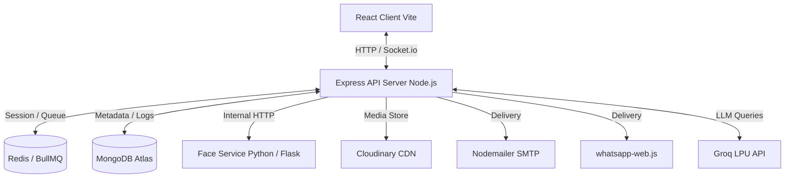

#  APES: Agentic Photos Evaluation and Segregation System

[](https://nodejs.org/)
[](https://www.python.org/)
[](https://react.dev/)
[](https://tailwindcss.com/)
[](https://www.mongodb.com/)
[](https://redis.io/)

APES is an AI-powered photo management system designed to bring intelligence and automation to how users organize, search, and share their digital memories. Instead of manual sorting, APES uses deep learning-based facial recognition, event-driven background queues, and natural language understanding to create an intuitive and efficient photo experience. 

---

## 📖 Table of Contents
1. [System Architecture](#-system-architecture)
2. [Key Features](#-key-features)
3. [Project Structure](#-project-structure)
4. [Prerequisites & Setup](#-prerequisites--setup)
   - [Environment Variables](#environment-variables-configuration)
   - [Face Recognition Service Setup (Python)](#1-face-recognition-service-setup-python)
   - [Express Backend Setup (Node.js)](#2-express-backend-setup-nodejs)
   - [React Client Setup (React/Vite)](#3-react-client-setup-reactvite)
5. [Core Workflows & Scenarios](#-core-workflows--scenarios)
6. [API Route Mapping](#-api-route-mapping)
7. [Database Schema Details](#-database-schema-details)

---

## 🏗️ System Architecture

APES is designed as a polyglot microservice system. Below is the architectural diagram showing component interfaces, data storage, and external integrations:



---

## ✨ Key Features

*   **🧠 Deep Learning Face Analysis:** Integrates **InsightFace (buffalo_l)** to extract 512-dimension face vectors. Leverages an IoU-based Non-Maximum Suppression (NMS) threshold of `0.70` to eliminate duplicate detections.
*   **🏷️ Smart Face Labeling:** Features a custom overlay canvas for manual annotations. Once a face is labeled, APES calculates the average centroid embedding to automatically suggest and propagate matching labels on future uploads.
*   **💬 Conversational AI Chat:** Powered by Groq LPU with multi-model routing (`llama-3.1-8b-instant` for quick searches and `llama-3.3-70b-versatile` for complex tool-calling workflows). Built-in rate limit fallbacks and regex parsing fail-safes (`parseFailedGeneration`) ensure continuous performance.
*   **📦 Intelligent Photo Delivery:** Distributes photos via Gmail (Nodemailer) and WhatsApp (via `whatsapp-web.js`). If photo payloads exceed standard constraints (e.g. 25MB for Gmail, 100MB for WhatsApp), APES dynamically prompts the user via Socket.io to compile them into an in-memory ZIP archive, uploads it to Cloudinary, and delivers a download proxy link.
*   **🧹 Auto-Cleanup Queue:** Utilizes **BullMQ** background queues for asynchronous processing. A recurring worker detects expired ZIP files from Cloudinary every 24 hours and purges database delivery references to reclaim storage.

---

## 📁 Project Structure

```
APES/
├── backend/                  # Node.js Express Server
│   ├── src/
│   │   ├── agent/            # Conversational AI agent loop (agentLoop.js)
│   │   ├── config/           # Database, Redis, and Cloudinary configurations
│   │   ├── controllers/      # Route controllers (photo, face, chat, delivery)
│   │   ├── middlewares/      # Authentication & validator middlewares
│   │   ├── models/           # Mongoose Database Schemas
│   │   ├── routes/           # Express REST API routes
│   │   ├── services/         # Integrations (email, WhatsApp, ZIP compression)
│   │   └── workers/          # BullMQ queue processor and cleanup workers
│   ├── package.json
│   └── worker.js             # Main BullMQ entrypoint
│
├── face-service/             # Flask Python Microservice (InsightFace)
│   ├── models/               # Cached ONNX models
│   ├── routes/               # Health and /recognize routes
│   ├── services/             # Bounding box & vector extraction algorithms
│   ├── utils/                # Image decoding and URL streaming helpers
│   ├── app.py                # Service entry point
│   ├── config.py             # Port & ML configurations
│   └── requirements.txt      # Scientific libraries (onnxruntime, insightface)
│
├── frontend/                 # React SPA (Vite + Tailwind CSS v4.0)
│   ├── src/
│   │   ├── components/       # Shared UI parts (Sidebar, Dropzone, Modals)
│   │   ├── pages/            # Dashboard, Gallery, FaceLabeling, and Chat client
│   │   ├── router/           # Routing configuration
│   │   └── main.jsx
│   ├── package.json
│   └── vite.config.js
│
├── shared/                   # Shared types, constraints, and helper functions
└── docs/                     # API specification, feature maps, and architectures
```

---

## ⚙️ Prerequisites & Setup

### Requirements
*   **Node.js**: `v18.0.0+`
*   **Python**: `v3.9.0+` (Python `v3.10` or `v3.13` is recommended)
*   **Redis**: Local instance running on port `6379` (or Upstash instance URL)
*   **MongoDB**: Local MongoDB instance or MongoDB Atlas Connection URI

---

### Environment Variables Configuration

Create a `.env` file in the **root** folder or configure individual `.env` files for the services:

#### **Backend (`backend/.env`)**
```env
PORT=5000
MONGO_URI=mongodb://localhost:27017/apes
REDIS_URL=redis://127.0.0.1:6379

# JWT settings
JWT_SECRET=your_jwt_secret_key_here
JWT_EXPIRES_IN=7d

# Groq API Keys
GROQ_API_KEY=your_groq_api_key_here
GROQ_FAST_MODEL=llama-3.1-8b-instant
GROQ_REASONING_MODEL=llama-3.3-70b-versatile

# Cloudinary Integration
CLOUDINARY_CLOUD_NAME=your_cloudinary_cloud_name
CLOUDINARY_API_KEY=your_cloudinary_api_key
CLOUDINARY_API_SECRET=your_cloudinary_api_secret

# Delivery Services
GMAIL_USER=your_gmail_username@gmail.com
GMAIL_APP_PASS=your_gmail_app_password

# Face Microservice URL
FACE_SERVICE_URL=http://localhost:5001
WHATSAPP_SESSION_PATH=./whatsapp-session
```

#### **Face Recognition Service (`face-service/.env`)**
```env
PORT=5001
FACE_MODEL=Facenet512
DETECTOR_BACKEND=retinaface
LOG_LEVEL=INFO
MIN_DETECTION_SCORE=0.40
```

#### **Frontend (`frontend/.env`)**
```env
VITE_API_URL=http://localhost:5000
VITE_SOCKET_URL=http://localhost:5000
```

---

### 1. Face Recognition Service Setup (Python)

1. Navigate to the `face-service/` directory:
   ```bash
   cd face-service
   ```
2. Create a Python virtual environment:
   ```bash
   python -m venv venv
   ```
3. Activate the virtual environment:
   *   **PowerShell (Windows):** `.\venv\Scripts\Activate.ps1`
   *   **CMD (Windows):** `.\venv\Scripts\activate.bat`
   *   **Linux/macOS:** `source venv/bin/activate`
4. Install requirements:
   ```bash
   pip install -r requirements.txt
   ```
5. Boot up the service:
   ```bash
   python app.py
   ```
   *The face microservice will listen on `http://localhost:5001`.*

---

### 2. Express Backend Setup (Node.js)

1. Navigate to the `backend/` directory:
   ```bash
   cd backend
   ```
2. Install standard Node dependencies:
   ```bash
   npm install
   ```
3. Start the Express API Server:
   ```bash
   npm run dev
   ```
   *The backend will boot on `http://localhost:5000`.*
4. In a separate terminal, start the BullMQ worker processor:
   ```bash
   node worker.js
   ```

---

### 3. React Client Setup (React/Vite)

1. Navigate to the `frontend/` directory:
   ```bash
   cd frontend
   ```
2. Install npm dependencies:
   ```bash
   npm install
   ```
3. Run the development Vite compiler:
   ```bash
   npm run dev
   ```
   *The React client will launch on `http://localhost:5173`.*

---

## 🔄 Core Workflows & Scenarios

### 📸 Ingestion & Face Processing
1. A user uploads photos through the frontend dropzone.
2. The backend uploads the image binaries to **Cloudinary** and pushes an ingestion task to the Redis `recognitionQueue`.
3. The **BullMQ** worker grabs the job, fetches the image URL, and makes an HTTP request to `/recognize` on the Face Service.
4. The Face Service downloads the photo, detects bounding boxes via **InsightFace**, filters overlaps using NMS, computes embeddings, and returns them to the worker.
5. The backend matches embeddings using Cosine Similarity against average Person centroids. It auto-labels faces exceeding the match threshold (`0.60`) and registers unknown faces.

### 💬 Agentic Retrieval & Actions
1. A user queries: *"Email Mom her photos from our trip last year."*
2. The Express server routes the command to the **Groq API** (`llama-3.3-70b-versatile`).
3. The model selects the necessary tools (e.g. `searchPhotos`, `emailPhotos`) and outputs JSON schema invocations.
4. The backend evaluates the tools, runs photo checks, and returns structural items.
5. If the total file attachment size is greater than 25MB, a **Socket.io** event `delivery:zip-confirm` is emitted to the React UI. Once confirmed, the system streams photos in parallel, compresses them to a ZIP file, uploads the archive to Cloudinary, and emails the download link.

---

## 🔗 API Route Mapping

### Authentication Routes
*   `POST /api/v1/auth/register` - Create a new user account.
*   `POST /api/v1/auth/login` - Validate credentials and return JWT tokens.

### Photo Management Routes
*   `POST /api/v1/photos/upload` - Upload image file and trigger recognition.
*   `GET /api/v1/photos` - Retrieve list of uploaded photos.
*   `DELETE /api/v1/photos/:id` - Delete photo from DB and Cloudinary.

### Face Labeling Routes
*   `GET /api/v1/faces/unlabeled` - Get all unrecognized face crops.
*   `POST /api/v1/faces/label` - Assign a name to a specific face embedding.
*   `GET /api/v1/faces/centroids` - Retrieve average centroid profiles.

### Conversational & Sharing Routes
*   `POST /api/v1/chat` - Chat with the agent loop.
*   `POST /api/v1/delivery/share` - Execute email or WhatsApp deliveries.
*   `GET /api/v1/delivery/history` - Fetch history logs of shares.
*   `GET /api/v1/delivery/download/:deliveryId` - Stream delivery ZIP file from Cloudinary.

---

## 🗄️ Database Schema Details

APES implements MongoDB modeling to maintain performance and data integrity:

```
┌─────────────────────────────────────────────────────────────┐
│                           User                              │
├─────────────────────────────────────────────────────────────┤
│ _id: ObjectId | email: String | passwordHash: String        │
└──────────────────────────────┬──────────────────────────────┘
                               │ 1
                               │
                               │ *
┌──────────────────────────────▼──────────────────────────────┐
│                           Photo                             │
├─────────────────────────────────────────────────────────────┤
│ _id: ObjectId | user: Ref(User) | cloudinaryUrl: String     │
│ bytes: Number | status: String ("processing", "completed")  │
└──────────────────────────────┬──────────────────────────────┘
                               │ 1
                               │
                               │ *
┌──────────────────────────────▼──────────────────────────────┐
│                           Face                              │
├─────────────────────────────────────────────────────────────┤
│ _id: ObjectId | photo: Ref(Photo) | bbox: Object            │
│ embedding: Array[512] | person: Ref(Person) | labeled: Bool│
└──────────────────────────────┬──────────────────────────────┘
                               │ *
                               │
                               │ 1
┌──────────────────────────────▼──────────────────────────────┐
│                           Person                            │
├─────────────────────────────────────────────────────────────┤
│ _id: ObjectId | name: String | centroidEmbedding: Array[512]│
└─────────────────────────────────────────────────────────────┘
```

---

## ⚖️ License
This project is licensed under the MIT License. See [LICENSE](LICENSE) for details.
