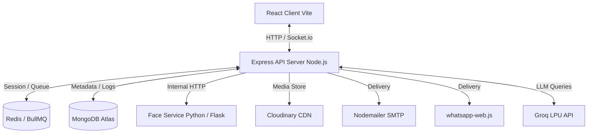
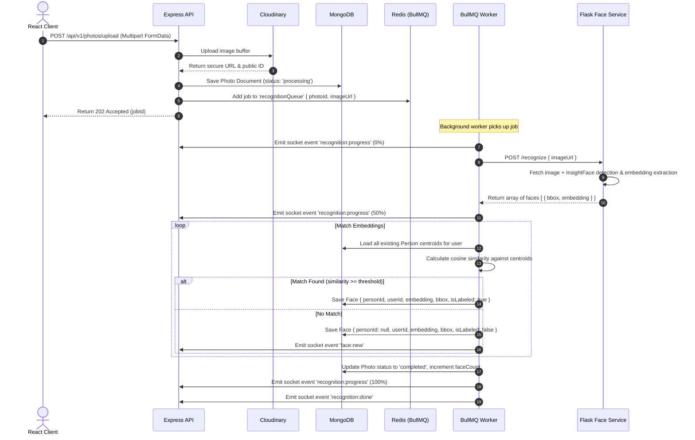
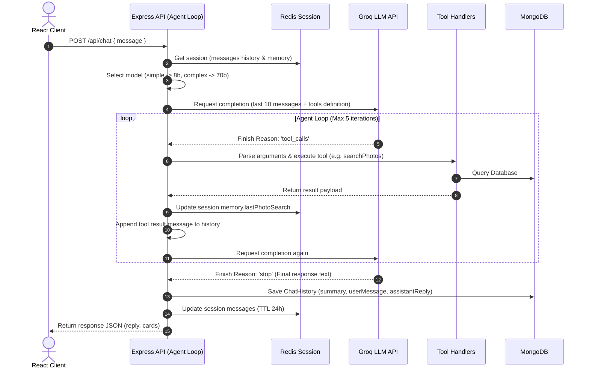
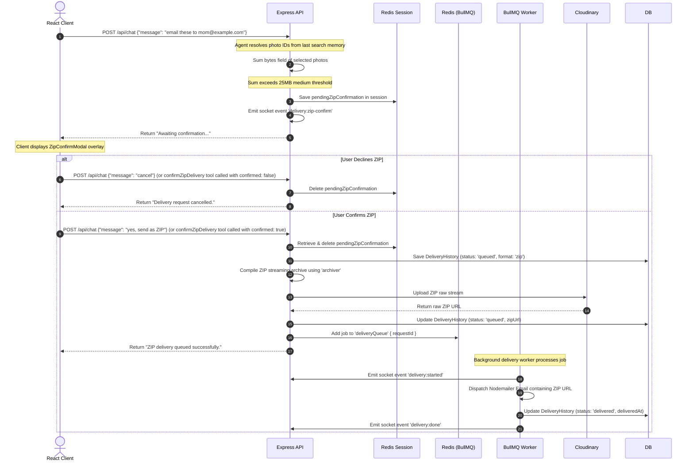

# Drishyamitra — System Architecture

This document describes the high-level design, component boundaries, background processing systems, and core workflows of the Drishyamitra (Agentic Photos Evaluation and Segregation) system.

---

## 1. System Overview

Drishyamitra is structured as a polyglot microservice architecture designed to handle photo storage, automatic face recognition, natural language retrieval, and action dispatching.



### Component Boundaries
* **React Client (Vite)**: Standard Single Page Application built on React, styled with Tailwind CSS v4.0. Renders the photo library gallery grid, crop canvas overlay for manual face labeling, real-time toast alerts, and a chat interface. Communicates via Socket.io and Axios.
* **Express API (Node.js)**: The orchestration core. Handles API routing, database schemas (via Mongoose), Socket.io connections, session caches, and the AI agent loop.
* **Python Face Service (Flask)**: Wrapper exposing face detection and embedding utilities. Accepts image URLs, downloads the image, extracts faces using the **InsightFace (buffalo_l)** library, applies IoU Non-Maximum Suppression (NMS) deduplication, and returns 512-dim embedding float arrays.
* **Redis (Upstash / Local)**: Dual namespace cache store:
  1. *BullMQ Job Queues*: Organizes asynchronous jobs for face ingestion, email/WhatsApp delivery, and temporary asset cleanup.
  2. *Session Store*: Caches agent conversation history and memory with a 24-hour TTL.
* **MongoDB Atlas**: Persistent database storing records for users, photos, faces, named personas, chat histories, and delivery audits.

---

## 2. Background Queue & Worker Architecture

To prevent long-running tasks from blocking the Express event loop, Drishyamitra uses a Redis-backed **BullMQ** job pipeline:

```
[Express API]
      │
      ├─► Add Job ──► [ recognitionQueue ] ──► [ recognition.worker.js ] ──► Socket.io Events
      │
      ├─► Add Job ──► [ deliveryQueue ] ──► [ delivery.worker.js ] ──► SMTP / WA
      │
      └─► Schedule ──► [ zipCleanupQueue ] ──► [ cleanupZip.worker.js ] ──► Cloudinary Purge
```

1. **`recognitionQueue`**:
   - Spawns a job whenever a photo is uploaded.
   - The worker calls the Python service, updates the database face embeddings, computes similarities, and pushes real-time telemetry back to the client via Socket.io.
2. **`deliveryQueue`**:
   - Handles photo delivery tasks asynchronously.
   - Invokes SMTP Nodemailer or whatsapp-web.js depending on the medium requested, updating the delivery record status on completion or failure.
3. **`zipCleanupQueue`**:
   - Runs a repeatable cron job (every 24 hours) to locate expired ZIP archives in `DeliveryHistory`, delete the raw ZIP assets from Cloudinary, and clear the database links.

---

## 3. Core Workflows

### Workflow A: Photo Upload & Ingestion Pipeline



---

### Workflow B: Agent Query & Tool Calling Loop



---

### Workflow C: Smart ZIP Delivery Confirmation Flow

This workflow illustrates how the system manages oversized deliveries (exceeding Gmail's 25MB or WhatsApp's 100MB limits).


